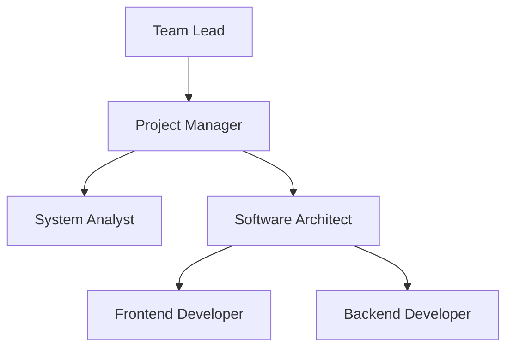
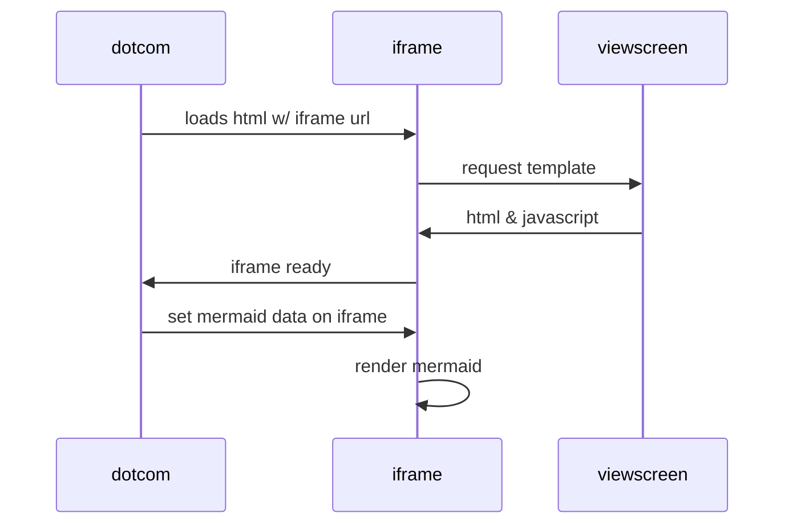
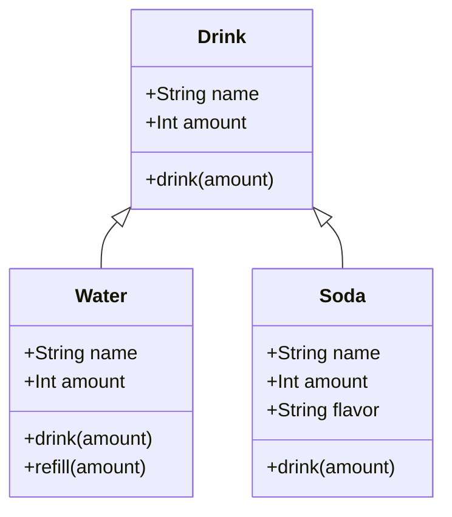
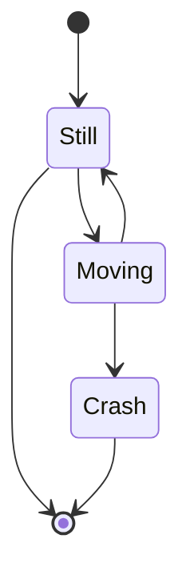
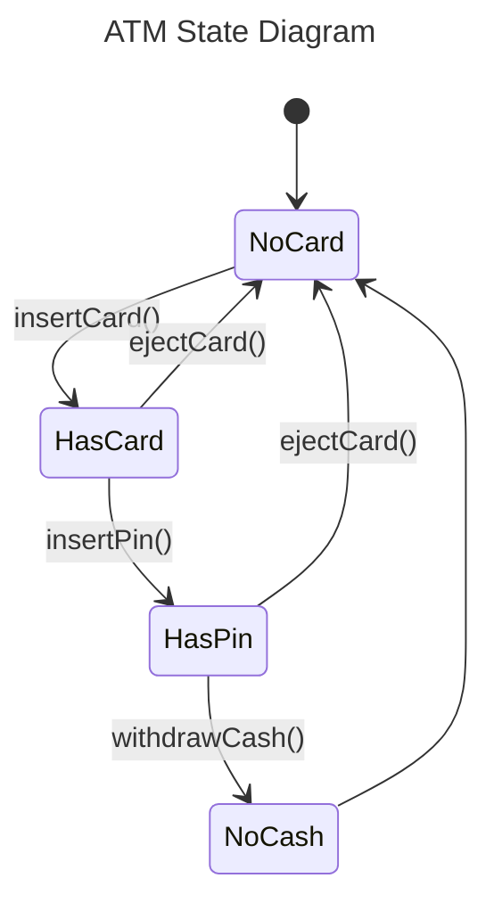
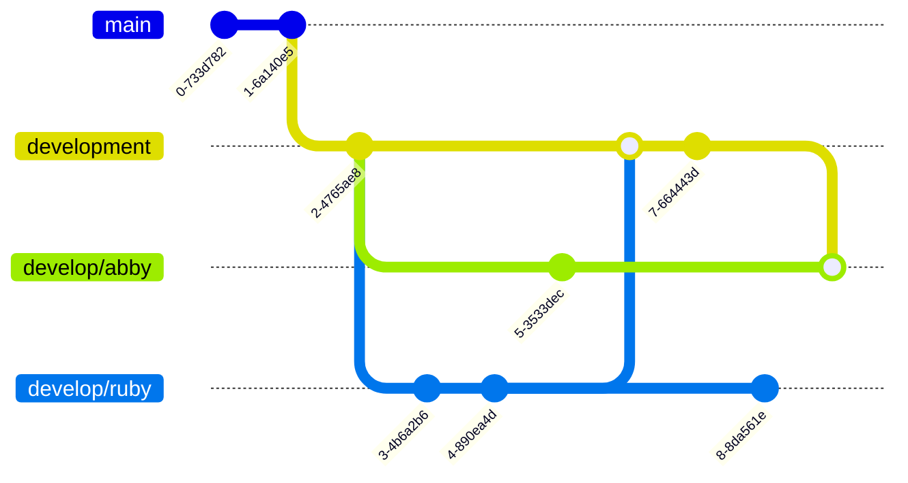
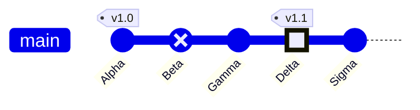
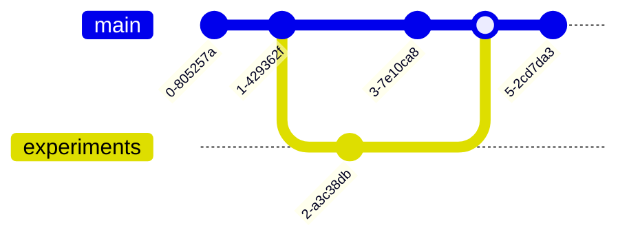

# Mermaid Diagram

You can use Mermaid diagram on **Cayman Improved** by including the declaring script on `_layouts/default.html`:

```html
<script src="https://unpkg.com/mermaid@10/dist/mermaid.min.js"></script>
<script>
    mermaid.initialize({
      startOnLoad:true,
      theme: "dark",
    });
    window.mermaid.init(undefined, document.querySelectorAll('.language-mermaid'));
</script>
```

By default & natively on Markdown, it should be rendered by writing mermaid syntax as follow:

~~~md

~~~

And it displayed as follow:


Let's take on another example, organizational chart:



## UML Languages

Mermaid can be a helpful diagram language to display your own **UML Diagram** such as Sequence Diagram, Class Diagram, State Diagram, Entity Relationship Diagram, etc. using your Markdown notation and code syntax to display the diagram.

Let's take on simple sequence diagram and class diagram below:



Class Diagram:



State Diagram:






## Git Graph

Mermaid can be handful diagram language to create git graph as well!



By declaring `gitGraph` and add a `commit` to line up the git log:

~~~md

~~~


You can create a branch by using `branch` and switch to another branch with `checkout`. To merge from a branch, use `merge <branch>` to merge commits from `<branch>`:

~~~md

~~~


